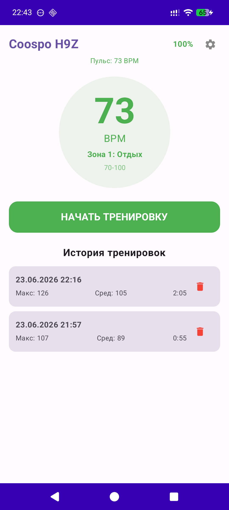
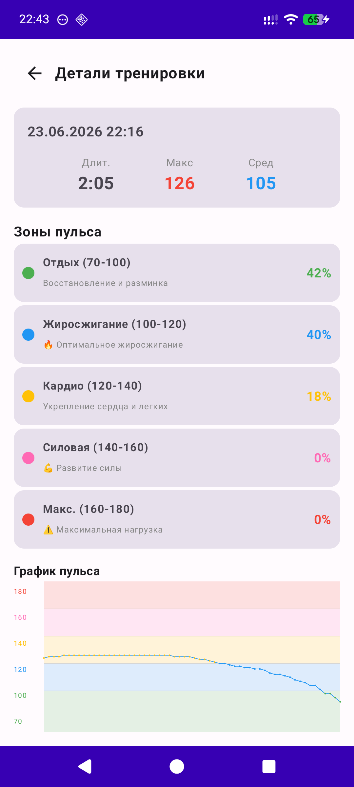

# coospohrm

Coospo H9Z Chest Heart Rate Monitor Workout Manager

Features battery level display, workout manager, last 60 heart rate chart, and calorie counter.

Device syncing is done via Bluetooth and after the app is turned on.

<<<<<<< HEAD
#Version

Version 1.3: New technical about calculation cals and bug fig(rotation screen and etc)

Version 1.2: Added calorie counter

Version 1.1: Bug fix

=======
Version 1.2: Added calorie counter

Version 1.1: Bug fix

>>>>>>> ebfbb3dbf2e30e59b6f78dcf4b862cebc74ddc86
Version 1.0: Ideas release

  
  &nbsp;&nbsp;&nbsp;&nbsp;
  

