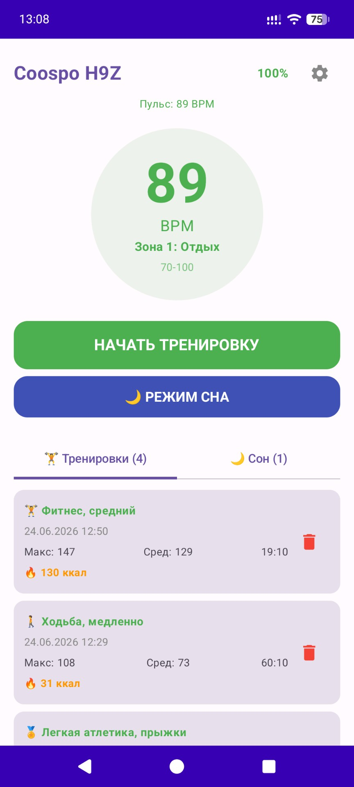

# coospohrm

Coospo H9Z Chest Heart Rate Monitor Workout Manager

Features battery level display, workout manager, last 60 heart rate chart, and calorie counter.

Device syncing is done via Bluetooth and after the app is turned on.

#Version

Version 1.4.1: Bug fix for reconnect

Version 1.4: Add Sleep traine mode 

Version 1.3: New technology information about calculation calculations and errors (rotation screen and etc)

Version 1.2: Added calorie counter

Version 1.1: Bug fix

Version 1.0: Ideas release

  
  &nbsp;&nbsp;&nbsp;&nbsp;
  
  &nbsp;&nbsp;&nbsp;&nbsp;
  

